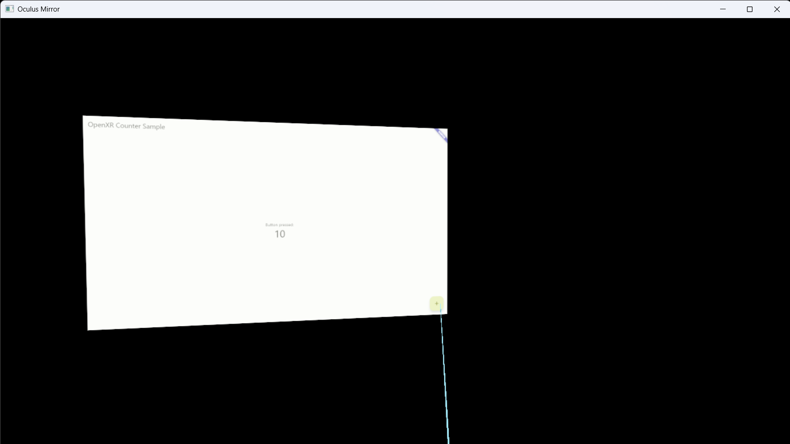

# flutter_open_xr

[English](README.md) | [日本語](README.ja.md)

[](https://pub.dev/packages/flutter_open_xr)



Flutter UIを、1コマンドでWindows向けOpenXRランタイムホストとしてビルドするCLIです。

> [!WARNING]
> このプロジェクトは開発中の実験段階です。
> API、出力構成、ビルド挙動はリリース間で変更される可能性があります。

## このプロジェクトでできること

`flutter_open_xr`は、次の用途を想定しています。

- UIはFlutterのまま維持する
- ネイティブWindows OpenXRホストで実行する
- 手順をスクリプト化し、再現可能なビルドを行う

## `build`コマンドの処理

`dart run flutter_open_xr build` は以下を実行します。

1. `flutter pub get`
2. `flutter build bundle --debug --target-platform=windows-x64`
3. ローカルFlutterの`engineRevision`に一致するembedder ZIPを取得
4. OpenXR-SDK `release-1.1.57` を使用（`--openxr-sdk-dir`指定時は既存SDKを使用）
5. `native/windows` をCMake + MSBuildでビルドし、成果物を出力先へコピー

## インストール

```powershell
flutter pub add flutter_open_xr
```

または`pubspec.yaml`へ直接追加:

```yaml
dependencies:
  flutter_open_xr: ^0.1.1
```

## クイックスタート

Flutterプロジェクトのルートで実行:

```powershell
dart run flutter_open_xr build
```

オプション一覧:

```powershell
dart run flutter_open_xr build --help
```

実行せずに手順だけ確認:

```powershell
dart run flutter_open_xr build --dry-run
```

## Runtime background control

Flutter側から背景を切り替えるには `package:flutter_open_xr/background.dart` を利用します。

```dart
import "package:flutter_open_xr/background.dart";
```

- `XrBackgroundController.setNone()`
- `XrBackgroundController.setGroundGrid()` (default)
- `XrBackgroundController.setDdsFile(path)` (`.dds`)
- `XrBackgroundController.setGlbFile(path)` (現在は未対応エラー)

## ビルドオプション

```text
--project-dir <path>      Flutterプロジェクトディレクトリ（デフォルト: カレント）
--output-dir <path>       ランタイム成果物の出力先
--openxr-sdk-dir <path>   既存OpenXR-SDKディレクトリを使用（cloneをスキップ）
--cmake <path>            CMake実行ファイルパス（デフォルト: cmake）
--flutter <path>          Flutter実行ファイルパス（デフォルト: flutter）
--git <path>              Git実行ファイルパス（デフォルト: git）
--configuration <name>    Debug / Release / RelWithDebInfo / MinSizeRel（デフォルト: Release）
--dry-run                 コマンドを表示のみ
```

## 必要環境

- Windows 10/11
- Visual Studio 2022 Build Tools（C++ツールチェーン）
- CMake
- Flutter SDK
- OpenXR Runtime（例: Quest Link / SteamVR）

## 出力

デフォルト出力ディレクトリ:

```text
<project>/build/flutter_open_xr/windows/Release
```

生成される実行ファイル:

```text
flutter_open_xr_runner.exe
```

## ローカル検証サンプル

このリポジトリの`example/`にサンプルアプリがあります。
ローカルパス依存で`flutter_open_xr`を参照します。

```yaml
dependencies:
  flutter_open_xr:
    path: ..
```

実行:

```powershell
cd example
flutter pub get
dart run flutter_open_xr build --dry-run
```
